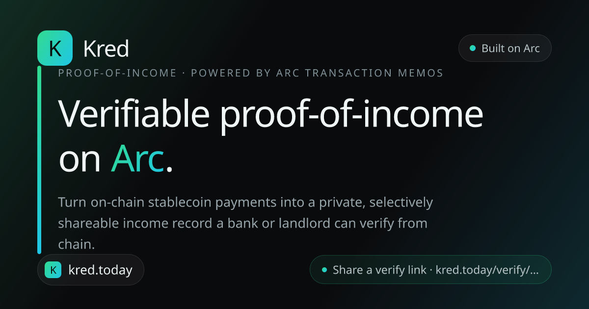

<div align="center">



# Kred

**Your on-chain income, turned into proof a bank will accept.**

[**kred.today**](https://kred.today) · built on [Arc](https://www.arc.io/), Circle's stablecoin L1 · powered by Arc Transaction Memos

</div>

---

## The problem

You get paid in USDC. Your rent application asks for a payslip.

Millions of freelancers, contractors, and remote workers earn real, steady income in
stablecoins — and have **nothing** a bank, landlord, or visa officer will accept as
proof. Screenshots can be faked. Spreadsheets are just your word. Payroll providers
don't know you exist.

Meanwhile every payment you've ever received is already sitting on a public ledger,
mathematically verifiable by anyone. Kred is the bridge between those two facts.

## What you can do with Kred

**📥 Get an income passport, automatically.**
Connect your wallet and Kred indexes every incoming USDC/EURC payment on Arc — amounts,
dates, payers. Payments sent through Arc's Memo contract arrive **already labeled** with
client, project, and invoice. Everything else you can tag yourself.

**🔗 Get paid with context.**
Send a client a payment link with the invoice details baked in. When they pay, the memo
travels *on-chain in the same transaction* as the money — so the payment lands in your
history pre-categorized. No client account needed.

**📄 Generate a real income statement.**
Pick a period → totals by client and category, a monthly trend chart, and a branded PDF
where **every line item carries its transaction hash**. Not "trust me" — "check it."

**🛡️ Share proof, not spreadsheets.**
Create a verify link and choose exactly what it reveals — period, payment count,
clients, wallet — and what stays private. Whoever opens it sees your income
**recomputed live from the blockchain**, not from our database.

**⚓ Anchor it on-chain.**
Optionally stamp a tamper-evident fingerprint of your proof into the `KredRegistry`
contract from your own wallet. The verify page shows *when* it was anchored — read
straight from the contract, impossible to backdate or fake.

## Why a bank can actually trust this

Most "proof" tools show you a number they stored. Kred never stores a number.

1. The database holds only **which transactions** you disclosed and **which fields**
   to show. No amounts, ever.
2. When someone opens your verify link, the server **re-derives every amount from Arc
   transaction receipts, live** — hacking our database changes nothing.
3. The optional on-chain anchor is read back from the contract keyed by *your* wallet,
   so even the "anchored on" timestamp can't be forged.

If Kred disappeared tomorrow, every number it ever showed would still be independently
checkable on [Arcscan](https://testnet.arcscan.app).

## The Arc-native part

Arc's **Memo contract** wraps a token transfer and emits structured context in the same
transaction, while the `CALL_FROM` precompile keeps the real payer as the sender. One
tx = money **and** meaning. Kred both writes memos (payment requests) and reads them
(auto-categorized income) — plus handles Arc's quirk where **USDC is the native gas
coin** (its transfers emit from `0xff…fe` at 18 decimals, normalized to the 6-decimal
ERC-20 view). Every verified Arc fact lives in [`docs/arc-notes.md`](docs/arc-notes.md).

## Run it yourself

```bash
npm install
cp .env.example .env           # .env (not .env.local) — Prisma's CLI only reads .env
# set DATABASE_URL to any Postgres you control, then:
npx prisma migrate deploy
npm run dev                    # http://localhost:3000
```

Switch your wallet to **Arc Testnet** when prompted and fund it from the
[Circle faucet](https://faucet.circle.com).

<details>
<summary><b>Configuration & contract deployment</b></summary>

| Variable | Required | Purpose |
|---|---|---|
| `DATABASE_URL` | yes | Postgres for tags + disclosure prefs (never amounts) |
| `NEXT_PUBLIC_WC_PROJECT_ID` | no | WalletConnect id — without it only injected wallets (MetaMask) connect |
| `NEXT_PUBLIC_APP_URL` | no | Absolute origin for share metadata (defaults to `https://kred.today`) |
| `NEXT_PUBLIC_KRED_REGISTRY_ADDRESS` | no | Deployed `KredRegistry` — anchor UI stays dormant until set |
| `DEPLOYER_PRIVATE_KEY` | no | Only for `npm run deploy:registry`; never committed |

**Deploy the anchor contract:** fund a wallet at the faucet, put its key in `.env` as
`DEPLOYER_PRIVATE_KEY`, then `npm run deploy:registry` — it compiles
[`contracts/KredRegistry.sol`](contracts/KredRegistry.sol) with solc, deploys via viem,
and prints the address to set as `NEXT_PUBLIC_KRED_REGISTRY_ADDRESS`.

**Arc testnet:** chain id `5042002` · RPC `rpc.testnet.arc.network` · explorer
`testnet.arcscan.app` · USDC `0x3600…0000` · EURC `0x89B5…D72a` · Memo `0x5294…E505` ·
Multicall3 `0xcA11…CA11` (client reads are batched — the public RPC rate-limits).

</details>

<details>
<summary><b>Honest limitations (testnet MVP)</b></summary>

- **Arc testnet only** — test USDC/EURC. A production launch means Arc mainnet, a
  dedicated RPC, and a security review.
- Tags API trusts the address param (no Sign-In-with-Ethereum yet) — tags are
  cosmetic metadata; the chain-derived income/verify numbers need no auth by design.
- Verify links aren't globally rate-limited (bounded per link: ≤500 txs + caching).
- History indexes the most recent ~6,000 transfers (memo enrichment: ~250), and the
  UI says so instead of silently truncating.

</details>

## Stack

Next.js 14 · TypeScript · Tailwind + shadcn/Radix · wagmi/viem + RainbowKit ·
Recharts · @react-pdf/renderer · Prisma + Postgres · Solidity · Railway

---

<div align="center">

**[Open Kred →](https://kred.today)** — connect a wallet, or just open someone's verify link and check the math yourself.

</div>
